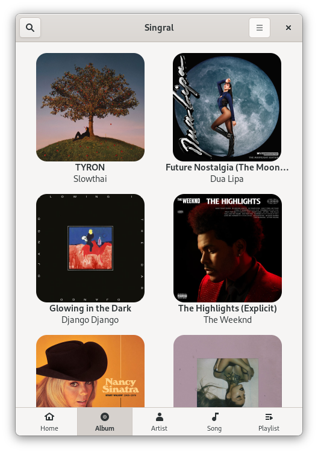
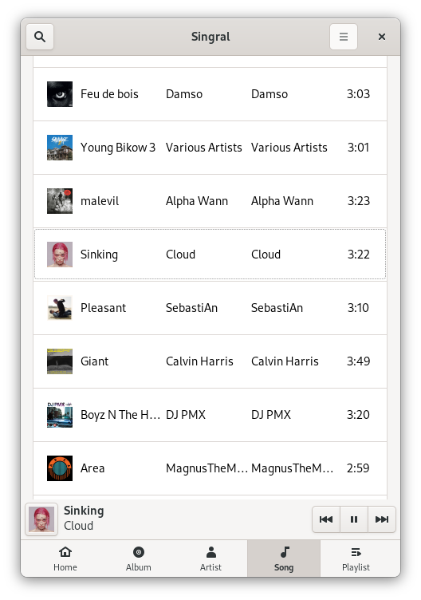

<h2 align="center">⚠️ THIS IS A STILL AT ALPHA STAGE ⚠️</h2>
<h2 align="center">There is few chance it works for now</h2>

<h1 align="center">
  <br>
  <p style="font-size: small;">(I need a icon)</p>
  Singral
</h1>

<p align="center"><strong>Qobuz client for GNOME</strong></p>

<br>


<p align="center">
  
  
</p>

<br>

## 🎵 Why Singral? TODO
A twist of the word : "Saint-Graal", which

In this case, the the goal is the HiRes music that Qobuz is offering

## 🧪 Features

I should create those

## 🏗️ Building from source

### GNOME Builder
GNOME Builder is the environment used for developing this application. 
It can use Flatpak manifests to create a consistent building and running 
environment cross-distro. Thus, it is highly recommended you use it.

1. Download [GNOME Builder](https://flathub.org/apps/details/org.gnome.Builder).
2. In Builder, click the "Clone Repository" button at the bottom, using `https://github.com/Aurnytoraink/Singral.git` as the URL.
3. Click the build button at the top once the project is loaded.

### Meson
```
git clone https://github.com/Aurnytoraink/Singral.git
cd Singral
meson builddir --prefix=/usr/local
ninja -C builddir install
```
