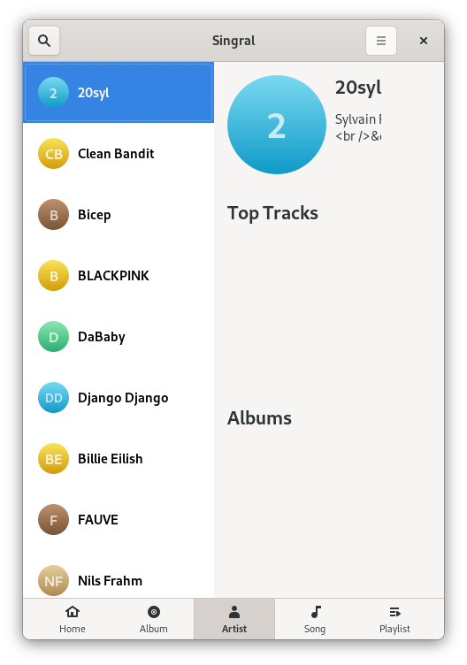

# WIP: Singral

A **WIP** Qobuz client for Gnome

## Screenshots
Photo by <a href="https://unsplash.com/@ekrull?utm_source=unsplash&amp;utm_medium=referral&amp;utm_content=creditCopyText">Eric Krull</a> on <a href="https://unsplash.com/?utm_source=unsplash&amp;utm_medium=referral&amp;utm_content=creditCopyText">Unsplash</a>

### Login Page

### Album Page

### Artist Page (Not working)

### Song Page

### On larger screen

### Extended player (design may vary in the future)
